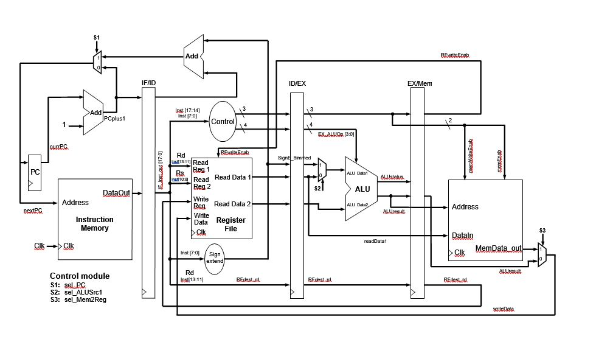

## Introduction
The uP16 is a very basic 3-stage pipelined processor. It has 2048 bytes of 18-bit instruction memory, 2048 bytes of 16-bit data memory and an 8 x 16-bit register file. Only full word accesses are supported (byte accesses are not supported). The program counter (PC) is 16 bits and indicates the next memory instruction to execute. As each instruction is executed, the PC increments by 1. On reset the PC is set to 0. There is no interrupt mechanism in the uP16 CPU. The block diagram of the uP16 processor is given.

**uP16 Register File**: The uP16 has 8 general purpose registers, R0 to R7. R0 is hardwired to 0. Thus R0 always reads as 0 and a write to R0 has no effect. The remaining registers are general purpose registers. A stack pointer (SP) and return address from a function call could be implemented using R6 and R7, respectively.

**uP16 Memory**: The uP16 Memory space consists of two arrays (an 18 bit wide instruction memory and a 16 bit wide data (and stack) memory. Separate block RAM (BRAM) memory is used for both the instruction and data memory, configured as 1024x18bit memory and 1024x16bit memory, respectively. 

**uP16 Instructions**: All uP16 instructions are 18-bit words stored in the instruction memory. There is only one instruction format (called R-format) as shown in table 1. The instruction set consists of a very basic set of instructions as given in table 2. Note that there are no jump instructions and only signed arithmetic operations are supported. The address is the 5 hex digits in the Code field of uP16_Assembler.xlsx. These are input as the lower 4 hex digits into the initialise data (INIT) and the 4 combined 2 MSBs into the initialise parity (INITP) fields in “Instruct_mem.v”

## Instruction Set Architecture 

### Table 1: The 18 bit instruction formats for the uP16 processor
| Field | 4 bits | 3 bits |	3 bits | 8 bits |
| :---- | :----- | :----- | :----- | :----- |
| R-format | OpCode	| Rd | Rs |	Function/Immed |

### Table 2: The instruction set for the uP16 processor
| Name | op | Funct/ Immed | Instruction | Effect(s) |
| :--- | :- | :----------- | :---------- | :-------- |
| nop |	0x00 |	0x00 |	nop | Do nothing (instruction word = 0) |
| add |	0x00 |	0x01 |	add rd, rs | RF[rd] = RF[rd] + RF[rs]; | 
| sub |	0x00 |	0x02 |	sub rd, rs | RF[rd] = RF[rd] - RF[rs]; |
| and |	0x00 |	0x03 |	and rd, rs | RF[rd] = RF[rd] and RF[rs]; |
| or |	0x00 |	0x04 |	or rd, rs |	RF[rd] = RF[rd] or RF[rs]; |
| nand | 0x00 |	0x05 |	nand rd, rs | RF[rd] = RF[rd] nand RF[rs]; | 
| nor |	0x00 |	0x06 |	nor rd, rs | RF[rd] = RF[rd] nor RF[rs]; | 
| xor |	0x00 |	0x07 |	xor rd, rs | RF[rd] = RF[rd] xor RF[rs]; | 
| not |	0x00 |	0x08 |	not rd, rs | RF[rd] = not RF[rs]; | 
||||||			
| mov |	0x00 |	0x0A |	mov rd, rs | RF[rd] = RF[rs]; |
||||||
| lw |	0x01 |	-- |	lw rd, rs, immed | RF[rd] <- memory(RF[rs]+immed); | 
| sw |	0x02 |	-- |	sw rd, rs, immed | RF[rd] -> memory(RF[rs]+immed); | 
|||||| 
| lli |	0x03 |	immed |	lli rd, rs, immed | RF[rd] = sign_ext(immed);    (rs is unused) |
| lui |	0x04 |	immed |	lui rd, rs, immed |	RF[rd] = {immed, RF[rs][7:0]} |
| addi | 0x05 |	immed |	addi rd, rs, immed | RF[rd] = RF[rs] + sign_ext(immed); |   
|||||| 
| | 0x6-8 | | | Reserved |
|||||| 				
| beq |	0x08 |	immed |	beq rd, rs, immed |	if (RF[rd] = = RF[rs]) pc += sign_ext(immed) + 1; |
| bne |	0x09 |	immed |	bne rd, rs, immed |	if (RF[rd] != RF[rs])  pc += sign_ext(immed) + 1; |
| blt |	0x0A |	immed |	bltz rd, rs, immed | if (RF[rd] < RF[rs])   pc += sign_ext(immed) + 1; |
| bgt |	0x0B |	immed |	bgtz rd, rs, immed | if (RF[rd] > RF[rs])   pc += sign_ext(immed) + 1; |
|||||| 
| | 0xC-F | | | Reserved |

## uP16 Diagram

****

***Disclaimer:*** This repo is no longer maintained and was submitted as part of the coursework assignment for CE2003